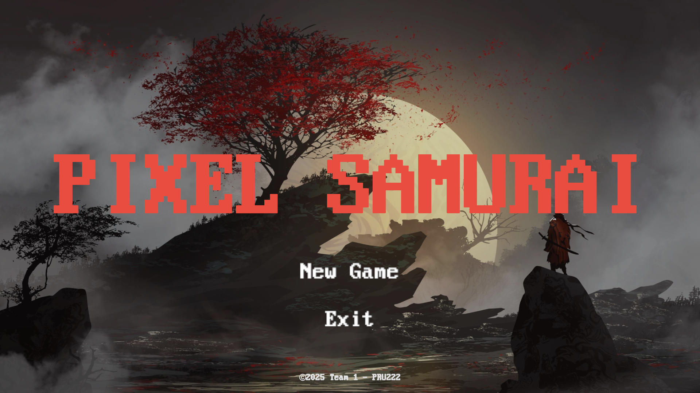
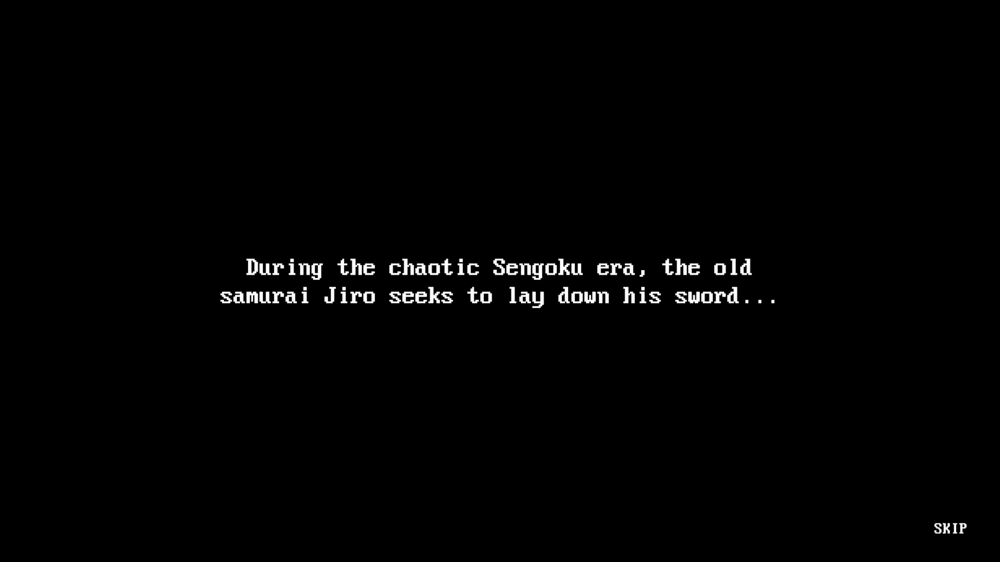
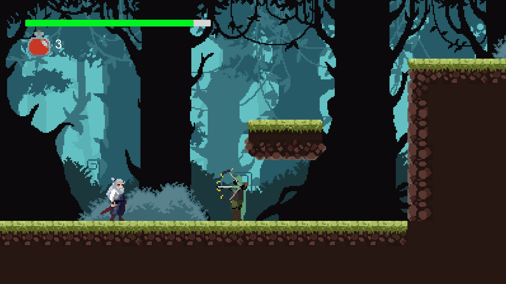
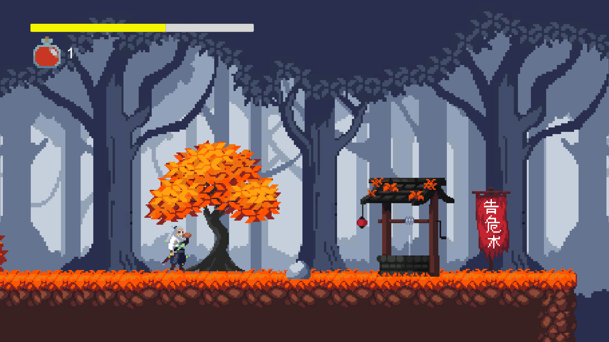
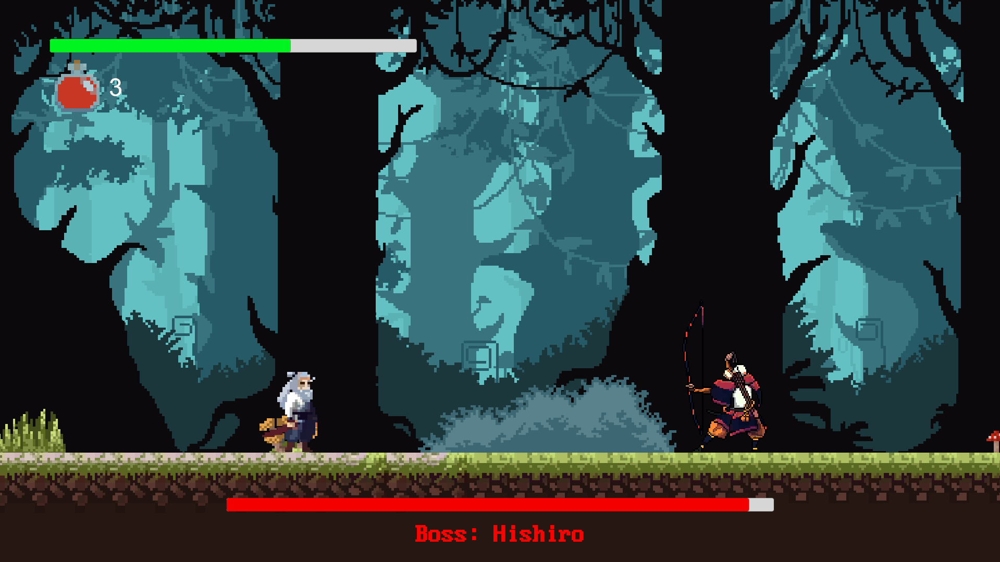
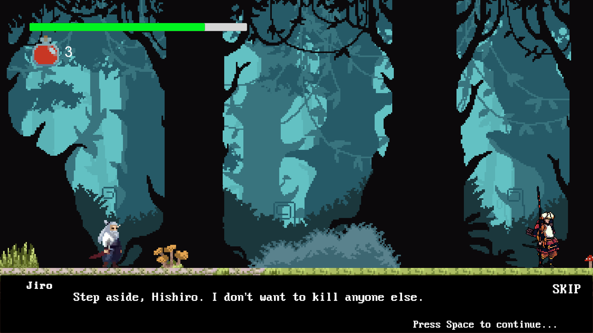
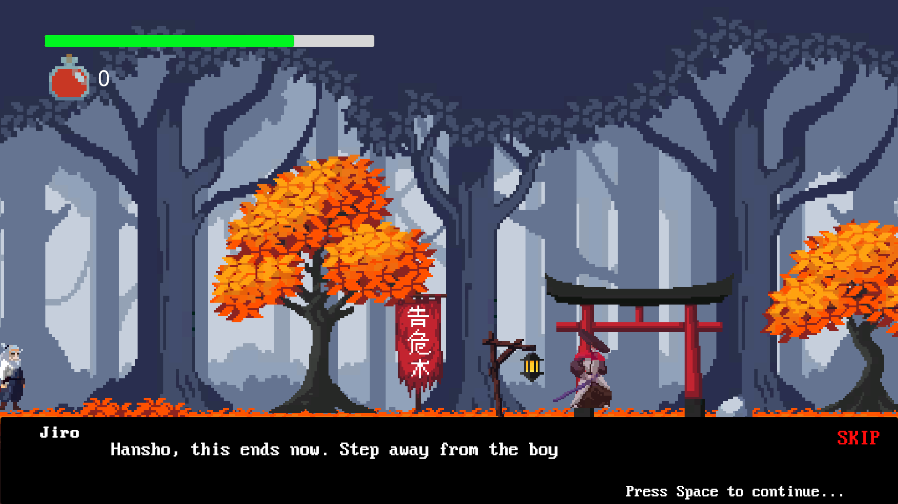
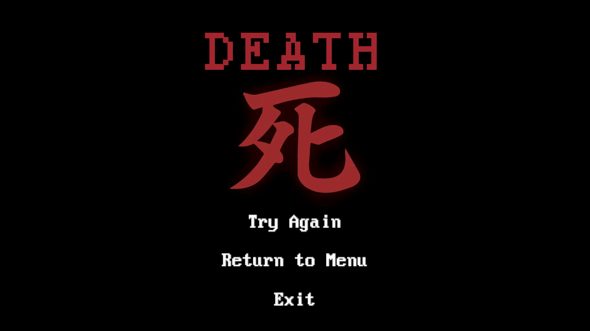
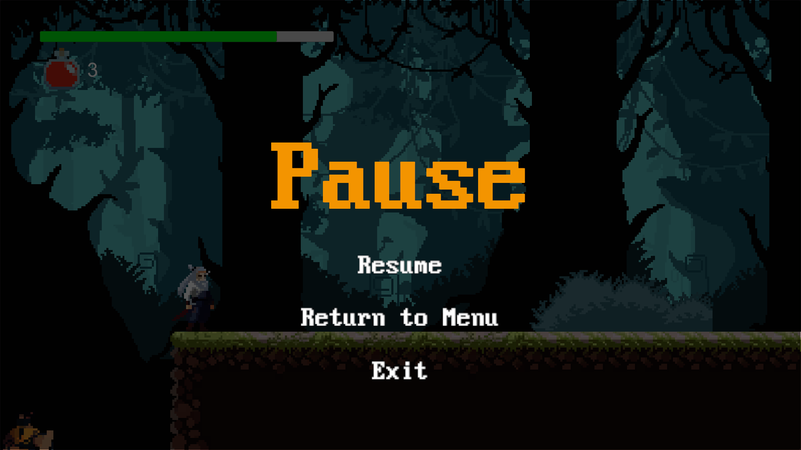

## Pixel Samurai
A challenging 2D action platformer built in Unity where players control a skilled samurai warrior battling through dangerous environments, defeating enemies, confronting powerful bosses, and mastering combat techniques.

### Technical Requirements
    Unity Version: Unity 6000.0.42f1
- Target Platform: Windows.

### Team Members
  _Nguyễn Quang Sơn
  _Võ Lê Đức Anh
  _Phan Đức Hậu
  _Nguyễn Minh Thành

## Core Features

### Player Mechanics
- **Fluid Movement System**: 
  - Precise platforming with wall jumps, ledge climbing, and dashing
  - Double jump abilities for advanced maneuverability
  - Wall sliding to navigate vertical challenges
- **Dynamic Combat System**: 
  - Fast-paced melee attacks with combo potential
  - Timing-based combat with strategic positioning
  - Enemy-specific attack patterns to master
- **After-Image Effect**: 
  - Visual flourish follows the player during dashes
  - Dynamic particle system enhances immersion
- **Healing System**:
  - Limited healing charges to restore health
  - Strategic timing required for healing (leaves player vulnerable)
  - Charges can be replenished by defeating enemies

### State-Based AI System
- **Finite State Machine Architecture**: Sophisticated enemy AI with multiple behavior states
- **Enemy Variety**: Different enemy types with unique attack patterns and behaviors
- **Patrolling System**: Enemies patrol environments, react to player presence
- **Boss Encounters**: Multi-phase boss battles with special abilities and attack patterns

### Health & Combat Management
- **Health System**: Trackable player and enemy health with visual indicators
- **Knockback Mechanics**: Players and enemies experience force when taking damage
- **Stun System**: Enemies can be stunned after taking substantial damage
- **Combat Animation Integration**: Seamless connection between animations and combat actions

### Boss Fight System
- **Two Unique Boss Battles**: Face distinctive boss enemies with different mechanics
- **Camera Management**: Special camera handling during boss encounters
- **Boss Health Bars**: Visual indicators of boss health status
- **Boss Arena Boundaries**: Confined spaces for intense boss confrontations
- **Scene Progression**: Advance through scenes after defeating bosses

### Game States
- **Main Menu**: Start game and access options
- **Pause Functionality**: Pause during gameplay with options to resume or quit
- **Game Over System**: Player death triggers game over sequence with restart options
- **Scene Management**: Progress through multiple game scenes

### Visual Effects
- **Death Particles**: Visual feedback when enemies or player dies
- **Attack Feedback**: Visual and audio cues for successful attacks
- **Environmental Details**: Responsive background elements enhance world immersion
- **UI Feedback**: Health bars, healing indicators, and other UI elements provide clear game state

## Game Flow
1. Begin at the main menu
2. Navigate through platforming challenges
3. Defeat enemies to progress and earn healing charges
4. Encounter and defeat boss characters
5. Progress to new areas with increasing difficulty
6. Upon death, return to checkpoints or restart

## Technical Implementation
- **State Machine AI**: Sophisticated behavior system for enemies and bosses
- **Object Pooling**: Efficient resource management for frequently used objects like projectiles
- **Event-Based Health System**: Health changes trigger UI updates through events
- **Scene Persistence**: Player data persists between scenes for continuous gameplay
- **Component-Based Architecture**: Modular code design for maintainable systems

## Tips for Success
- Master the dash ability to avoid damage and traverse difficult platforms
- Time your attacks carefully against different enemy types
- Save healing charges for boss encounters
- Learn boss attack patterns to find openings for counterattacks
- Use wall jumps and ledge grabs to access hidden areas
- Defeat normal enemies to restore healing charges before boss fights